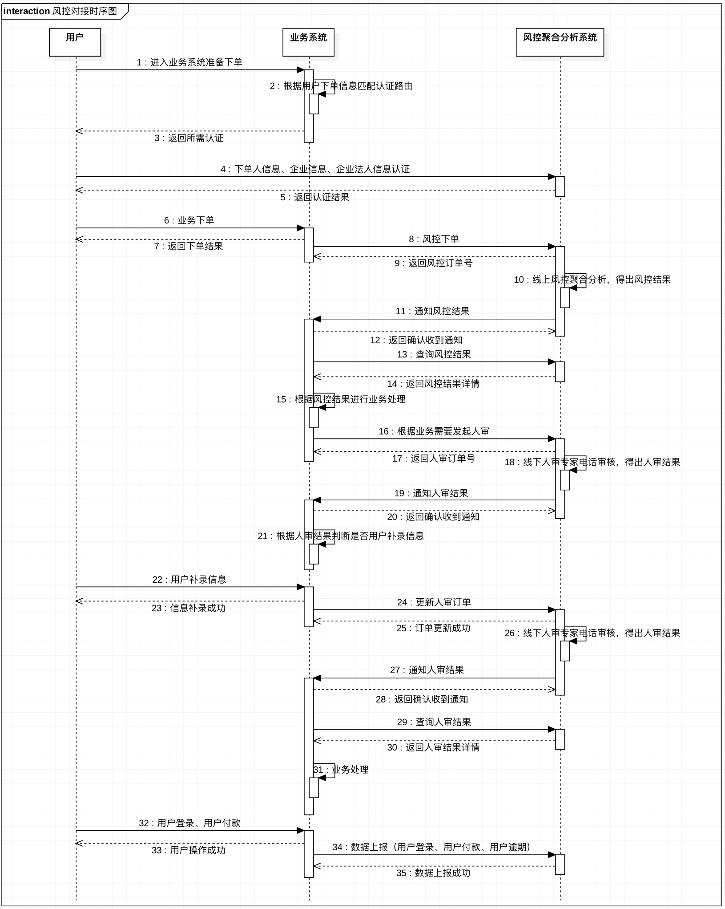

# 机蜜风控开放接口文档

---


## 1.概述
机蜜聚合风控分析系统是集成了芝麻、51信用、同盾、索伦、百融、白骑士等业内知名风控数据结合大数据分析和智能机器学习的手段打造的聚合风控分析系统，对外输出贷前反欺诈和用户画像评分及用户消费形态、贷中用户消费习惯培养和多头借贷预警、贷后催收和资产处置等服务。
### 1.1 总体架构

### 1.2 对接场景

### 1.3 对接准备
 > * step1 向机蜜申请接口调用凭证信息(appId、password、api_domain)；
 > * step2 向机蜜申请获取调试环境；（注意：测试环境为http协议，而生产环境为https协议）
 > * step3 根据接口文档开发对接接口；
 > * step4 提供服务器IP给机蜜配置白名单；
 > * step5 发布上线。

## 2.调用约定

### 2.1 请求
 > * 接口协议：http
 > * 请求方式：post
 > * 消息格式：application/json
 > * 消息编码：UTF-8
 
请求参数样例：

```
{
    "id":"517080601011",
    "appid":"jimi",
    "name":"xx"
}
```

### 2.2 响应
 > * 消息格式：application/json
 > * 消息编码：UTF-8

成功响应参数结构：

```
{
    "code":"200",
    "data":{
        "age":"20"
    }
}
```

失败响应参数结构：

```
{
    "code":"501",
    "message":"错误消息详情"
}
```

### 2.3 签名算法
为确保接口访问安全，接口的请求应对所有参数使用对称加密算法做签名校验。请求在header中加入签名参数。

Header参数：

| 名称    | 含义   |  类型  | 是否必填 | 备注            |
| :----   | :----  | :----  | :--      | :-------------  |
| appId |    应用唯一标识    |  varchar(32)  | Y | - |
| timestamp |    时间戳    |  varchar(32)  | Y | 时区GMT+8以秒为单位的时间戳 |
| deviceId |    设备标识    |  varchar(32)  | Y | - |
| OSVersion |    系统版本   |  varchar(32)  | Y | - |
| userId |    用户id   |  varchar(32)  | Y | - |
| signature    |    签名    |  varchar(32)  | Y | - |

签名算法：

 > * step1：把参数（appId，password，timestamp，deviceId，OSVersion，userId）的key和值value拼成字符串放入到数组，得到 array = ['value2=key2','value1=key1']
 > * step2：把数组按照ascii码进行升序排序，得到 array = ['value1=key1','value2=key2']
 > * step3：把数组的元素用&拼成一个字符串，得到 source = 'value1=key1&value2=key2'
 > * step4：根据step3得到的source生成MD5加密值，并转成大写，生成签名。signature=toUpperCase(Md5(source))


### 2.4 其它
 > * 所有请求和响应参数字段均为字符串格式
 > * 所有请求和响应金额参数的单位均为分

## 3. 接口列表

### 3.1 更新密钥接口-(算法签名更新，暂时停用)
为避免密钥泄露导致安全事故，对接方应定期调用此接口更新密钥。

接口地址：${api_domain}/api/open/secret/update/v1

请求参数：无

请求示例：

```
{
}
```

响应参数：

| 名称    | 含义   |  类型  | 是否必填 | 备注            |
| :----   | :----  | :----  | :--      | :-------------  |
| secret| 新的密钥 |   varchar(32) | Y | - |

响应示例：

```javascript
{
    "code":"200",
    "data":{
        "secret":""
    }
}
```


### 3.2 确认密钥接口-(算法签名更新，暂时停用)
更新密钥之后，可以使用新密钥来确认密钥是否更新成功。

接口地址：${api_domain}/api/open/secret/confirm/v1

请求参数：无

请求示例：

```
{
}
```

响应参数：

| 名称    | 含义   |  类型  | 是否必填 | 备注            |
| :----   | :----  | :----  | :--      | :-------------  |
| expire| 剩余使用时间 |   bigint | Y | 秒 |

响应示例：

```javascript
{
    "code":"200",
    "data":{
        "expire":"2592000"
    }
}
```

### 3.3 获取事务ID

接口地址：${api_domain}/api/transId/create/v1

请求参数：

请求头 Header加参数：

| 名称    | 含义   |  类型  | 是否必填 | 备注            |
| :----   | :----  | :----  | :--      | :-------------  |
| appId | 应用id |   varchar(50) | Y | - |
| deviceId | 设备id |   varchar(50) | Y | 设备唯一标识 |

请求体 Body参数：

| 名称    | 含义   |  类型  | 是否必填 | 备注            |
| :----   | :----  | :----  | :--      | :-------------  |
| extend | 扩展参数|   varchar(200) | N | 扩展参数 |

请求示例：

```
{
}
```

响应参数：

| 名称    | 含义   |  类型  | 是否必填 | 备注            |
| :----   | :----  | :----  | :--      | :-------------  |
| code | 响应码|   varchar(10) | Y | - |
| data | 事务id|   varchar(50) | Y | - |

响应示例：

```javascript
{
    "code":"200",
    "data":"7228282282828"
}
```


### 3.4 风控聚合模型审核下单
风控审核下单。

接口地址：${api_domain}/api/risk/proxy/create/v1

请求参数：

| 名称    | 含义   |  类型  | 是否必填 | 备注            |
| :----   | :----  | :----  | :--      | :-------------  |
| transactionId| 事务id |   varchar(50) | Y | - |
| callback| 回调地址 |   varchar(200) | Y | - |
| clientId| 调用方下单唯一标识 | varchar(32) | Y | - |
| strategyId| 风控策略唯一标识 | varchar(32) | Y | - |
| sceneType| 渠道场景 | varchar(30) | Y | - |
| idcardNum | 用户身份证号码 | varchar(20) | Y | - |
| idcardName | 用户身份证姓名 | varchar(40) | Y | - |
| phone | 用户手机号 | varchar(20) | Y | - |
| provice | 用户收货地址-省 | varchar(20) | Y | - |
| city | 用户收货地址-市 | varchar(20) | Y | - |
| regoin | 用户收货地址-区县 | varchar(40) | Y | - |
| address | 用户收货地址-详细地址 | varchar(100) | Y | - |
| sex | 用户性别 | varchar(4) | N | 男/女 |
| ip | 用户设备IP地址 | varchar(30) | N | - |
| email | 用户电子邮箱 | varchar(100) | N | - |
| mac | 用户设备物理地址 | varchar(30) | N | - |
| wifimac | 用户设备WiFi的物理地址 | varchar(30) | N | - |
| imei | 用户设备标识 | varchar(30) | N | 国际移动设备标识 |
| extend | 业务方独有数据源 | varchar(1000) | N | 扩展数据(三方独有数据)；json格式；作用：配合策略规则评分 |

请求示例：

```javascript
{
    "transactionId":"",
    "callback":"",
    "clientId":"",
    "strategyId":"",
    "sceneType":"",
    "idcardNum":"",
    "idcardName":"",
    "phone":"",
    "provice":"",
    "city":"",
    "regoin":"",
    "address":"",
    "extend":{
    	"jm_huabei_disabled":"true",
    	"jm_tongxunlu_uploaded":"true"
    }
}
```

响应参数：

| 名称    | 含义   |  类型  | 是否必填 | 备注            |
| :----   | :----  | :----  | :--      | :-------------  |
| id   | 风控订单号 | varchar(32) | Y | - |
| clientId| 调用方唯一标识 |   varchar(50) | Y | - |

响应示例：

```
{
    "code":"200",
    "data":{
        "id":"000000000000000000001",
        "clientId":"000000000000000000001"
    }
}
```


### 3.5 风控结果通知推送
当风控进度有变更时，机蜜风控系统会主动向调用方发起通知推送，推送间隔为（0s/2m/10m/1h/2h/6h/12h/24h），一直间隔推送8次或收到调用方接收成功的响应为止。

接口地址：调用方提供

请求参数：

| 名称    | 含义   |  类型  | 是否必填 | 备注            |
| :----   | :----  | :----  | :--      | :-------------  |
| id | 风控订单号 |   varchar(32) | Y | - |
| clientId | 调用方唯一标识 |   varchar(50) | Y | - |
| pldResult | 风控聚合自动审核结果 |   varchar(10) | Y | PASS-通过；REJECT-拒绝；REVIEW-需人审 |
| pldMsg   | 风控异常信息 | varchar(200) | N | - |


请求示例：

```
{
    "id":"00000000001",
    "clientId":"00000000001",
    "pldResult":"PASS"
}
```
响应参数：字符串

响应示例：

```
SUCCESS
```


### 3.6 风控结果查询
接口地址：${api_domain}/api/risk/proxy/query/v1

请求参数：

| 名称    | 含义   |  类型  | 是否必填 | 备注            |
| :----   | :----  | :----  | :--      | :-------------  |
| id   | 风控唯一标识 | varchar(32) | N | 两者不能同时为空 |
| clientId| 调用方唯一标识 | varchar(50) | N | 两者不能同时为空 |

请求示例：

```
{
    "id":"0000001"
}
```

响应参数：

| 名称    | 含义   |  类型  | 是否必填 | 备注            |
| :----   | :----  | :----  | :--      | :-------------  |
| pldResult | 风控结果 |   varchar(10) | Y | PASS-通过；REJECT-拒绝；REVIEW-人审 |
| pldMsg   | 风控异常信息 | varchar(200) | N | - |


响应示例：

```
{
    "code":"200",
    "data":{
        "pldResult":"PASS"
    }
}
```


### 3.7 风控线下专家审核下单
线下人审审核下单。

接口地址：${api_domain}/api/risk/review/order/create/v3

请求参数：

| 名称    | 含义   |  类型  | 是否必填 | 备注            |
| :----   | :----  | :----  | :--      | :-------------  |
| callback| 回调地址 |   varchar(200) | Y | - |
| transactionId| 事务id |   varchar(50) | Y | - |
| clientId| 调用方唯一标识 |   varchar(50) | Y | - |
| userId    |   下单用户唯一标识   |   varchar(50)   | Y | - |
| name    |   下单用户姓名   |   varchar(50)   | Y | - |
| phone   |    下单用户手机    |  varchar(15)  | Y | - |
| urlDetail   |    订单详情跳转链接    |  varchar(500)  | N | - |
| dataDetail  |    订单详情数据    |  [{}]  | Y | 订单详情数据；json格式； |


请求示例：

```javascript
{
    "callback":"",
    "transactionId":"",
    "clientId":"",
    "userId":"",
    "name":"",
    "phone":"",
    "urlDetail":"",
    "dataDetail":{
    	"enterpriseName":"企业名称举例",
    	"legalPersonName":"法人姓名举例"
    }
}
```

响应参数：

| 名称    | 含义   |  类型  | 是否必填 | 备注            |
| :----   | :----  | :----  | :--      | :-------------  |
| id   | 人审订单号 | varchar(32) | Y | - |
| clientId| 调用方唯一标识 |   varchar(50) | Y | - |

响应示例：

```
{
    "code":"200",
    "data":{
        "id":"000000000000000000002",
        "clientId":"000000000000000000002"
    }
}
```


### 3.8 人审结果通知推送
当人审进度有变更时，机蜜风控系统会主动向调用方发起通知推送，推送间隔为（0s/2m/10m/1h/2h/6h/12h/24h），一直间隔推送8次或收到调用方接收成功的响应为止。

接口地址：调用方提供

请求参数：

| 名称    | 含义   |  类型  | 是否必填 | 备注            |
| :----   | :----  | :----  | :--      | :-------------  |
| id | 人审订单号 |   varchar(32) | Y | - |
| clientId | 调用方唯一标识 |   varchar(50) | Y | - |
| reviewResult | 人审审核结果 |   varchar(10) | Y | auditPass-人审通过；auditRefuse-人审拒绝；auditCancel-人审取消；auditContactAgain-人审需再次联系；supplementInfo-需完善信息 |
| reviewDate | 人审审核时间 |   datetime | Y | - |
| reviewRemark   | 人审备注信息 | varchar(200) | N | - |
| enterpriseCredit   | 企业授信额度 | bigint | N | - |

请求示例：

```
{
    "id":"00000000001",
    "clientId":"00000000001",
    "reviewResult":"",
    "reviewDate":""
}
```

响应参数：字符串

响应示例：

```
SUCCESS
```

### 3.9 风控线下专家审核下单-更新人审订单信息
人审结果为“需完善信息”时，需要更新人审订单信息。

接口地址：${api_domain}/api/risk/review/order/updata/v3

请求参数：

| 名称    | 含义   |  类型  | 是否必填 | 备注            |
| :----   | :----  | :----  | :--      | :-------------  |
| id| 人审订单id |   varchar(32) | Y | - |
| clientId| 调用方唯一标识 |   varchar(50) | Y | - |
| urlDetail   |    订单详情跳转链接    |  varchar(500)  | N | - |
| dataDetail  |    订单详情数据    |  [{}]  | Y | 订单详情数据；json格式； |

请求示例：

```javascript
{
    "id":"",
    "clientId":"",
    "urlDetail":"",
    "dataDetail":{
    	"enterpriseName":"企业名称举例",
    	"legalPersonName":"法人姓名举例"
    }
}
```

响应参数：

| 名称    | 含义   |  类型  | 是否必填 | 备注            |
| :----   | :----  | :----  | :--      | :-------------  |
| result   | 更新结果 | varchar(10) | Y | - |

响应示例：

```
{
    "code":"200",
    "data":{
        "result":"成功"
    }
}
```


### 3.10 人审结果查询
接口地址：${api_domain}/api/risk/review/order/query/v3

请求参数：

| 名称    | 含义   |  类型  | 是否必填 | 备注            |
| :----   | :----  | :----  | :--      | :-------------  |
| id   | 人审唯一标识 | varchar(32) | N | 两者不能同时为空 |
| clientId| 调用方唯一标识 | varchar(50) | N | 两者不能同时为空 |

请求示例：

```
{
    "id":"0000001"
}
```

响应参数：

| 名称    | 含义   |  类型  | 是否必填 | 备注            |
| :----   | :----  | :----  | :--      | :-------------  |
| reviewResult | 人审审核结果 |   varchar(10) | Y | auditPass-人审通过；auditRefuse-人审拒绝；auditCancel-人审取消；auditContactAgain-人审需再次联系；supplementInfo-需完善信息 |
| reviewDate | 人审审核时间 |   datetime | Y | - |
| reviewRemark   | 人审备注信息 | varchar(200) | N | - |


响应示例：

```
{
    "code":"200",
    "data":{
    	"reviewResult":"",
    	"reviewDate":"",
    	"reviewRemark":""
    }
}
```


### 3.11 数据上报
接口地址：${api_domain}/api/risk/feedback/enterprise/upload/v1

请求参数：

| 名称    | 含义   |  类型  | 是否必填 | 备注            |
| :----   | :----  | :----  | :--      | :-------------  |
| userId   | 用户id | varchar(50) | N | - |
| phone   | 用户手机号 | varchar(20) | N | - |
| orderId   | 订单id | varchar(50) | N | - |
| uploadScene   | 上传时场景 | varchar(20) | Y | 'loginSuc'-登录成功，'loginFail'-登录失败，'orderSuc'-下单完成后-成功，'orderFail'-下单完成后-失败，'paySuc'-支付成功，'payFail'-支付失败，'orderOverdue'-订单逾期  |
| dataChannel   | 数据渠道	| varchar(50) | Y | baiqishi-白骑士 |
| dataId   | 数据渠道标识	 | varchar(100) | Y | baiqishiToken-白骑士token； |
| deviceId   | 设备标识	 | varchar(50) | N | - |
| appChl  | 应用渠道	 | varchar(50) | N | - |
| appVer  | 应用版本	| varchar(50) | N | - |
| network  | 联网方式	 | varchar(50) | N | - |
| operator | 运营商	 | varchar(50) | N | - |
| brand  | 设备品牌	 | varchar(50) | N | - |
| model | 设备型号 | varchar(50) | N | - |
| res  | 设备屏幕分辨率	 | varchar(50) | N | - |
| sysVer  | 系统版本	 | varchar(50) | N | - |
|  imei | imei信息	 | varchar(50) | N | - |
|  imsi |  imsi信息	| varchar(50) | N | - |
|  mac | mac地址	 | varchar(50) | N | - |
| wifiMac  | wifi-mac	 | varchar(50) | N | - |
| latitude  | 纬度 | varchar(50) | N | - |
|  longitude | 经度	 | varchar(50) | N | - |

请求示例：

```
{
    "id":"0000001"
}
```

响应参数：

| 名称    | 含义   |  类型  | 是否必填 | 备注            |
| :----   | :----  | :----  | :--      | :-------------  |
| code   | 响应码 | varchar(10) | Y | - |


响应示例：

```
{
    "code":"200"
}
```


## 3.12 企业认证
### 认证相关约定

认证节点约定：

| 节点    | 节点类型   | 备注            |
| :----   | :----  | :-------------  |
| 企业认证节点	   | enterpriseVerifyNode | - |
| 法人认证节点	   | legalPersonVerifyNode  | - |
| 经办人认证节点	   | agentPersonVerifyNode | - |

认证流程结果约定（flowResult）：

| 返回值    | 中文含义   | 备注            |
| :----   | :----  | :-------------  |
| success	   | 成功 | - |
| ongoing	   | 进行中  | - |
| fail	   | 失败 | - |


认证节点结果约定（nodeResult）：

| 返回值    | 中文含义   | 备注            |
| :----   | :----  | :-------------  |
| success	   | 成功 | - |
| fail	   | 失败 | - |


### 3.12.1 风控认证初始化接口
接口地址：${api_domain}/api/risk/lease/identity/verify/init/v1

请求参数：

| 名称    | 含义   |  类型  | 是否必填 | 备注            |
| :----   | :----  | :----  | :--      | :-------------  |
| transactionId   | 事务id | varchar(50) | Y | - |
| userId   | 用户id	 | varchar(32) | Y | - |
| extend   | 扩展参数 | varchar(500) | Y | json格式字符串；内容见下表详情 |

extend详情：

| 名称    | 含义   |  类型  | 是否必填 | 备注            |
| :----   | :----  | :----  | :--      | :-------------  |
| isEnterprise   | 是否是企业租赁 | int | Y | 0-否；1-是 |
| personType   | 身份 | varchar(20) | Y | legal-法人；agent-经办人 |


响应参数：

| 名称    | 含义   |  类型  | 备注            |
| :----   | :----  | :----  |  :-------------  |
| transactionId   | 事务id| varchar(50) |  - |
| flowId   | 认证流程id | varchar(32) |  - |
| flowResult   | 认证流程结果	 | varchar(32) |  见认证流程结果约定 |
| resultMessage   | 结果内容 | varchar(200) |  - |
| nextNodeType   | 下一个认证节点类型标识 | varchar(50) |  见认证节点约定 |
| nextNodeId   | 下一个认证节点id | varchar(32) |  - |


### 3.12.2 企业认证节点提交接口
接口地址：${api_domain}/api/risk/identity/verify/enterpriseVerifyNode/v1

请求参数：

| 名称    | 含义   |  类型  | 是否必填 | 备注            |
| :----   | :----  | :----  | :--      | :-------------  |
| transactionId   | 事务id | varchar(50) | Y | - |
| flowId   | 认证流程id	 | varchar(32) | Y | - |
| nodeId   | 认证节点id	 | varchar(32) | Y | - |
| enterpriseName   | 企业名称 | varchar(100) | Y | - |
| enterpriseCreditCode   | 企业信用代码	 | varchar(100) | Y | - |
| legalPersonName   | 法人身份证姓名	 | varchar(50) | Y | - |


响应参数：

| 名称    | 含义   |  类型  | 备注            |
| :----   | :----  | :----  |  :-------------  |
| transactionId   | 事务id| varchar(50) |  - |
| flowId   | 认证流程id | varchar(32) |  - |
| flowResult   | 认证流程结果	 | varchar(32) |  见认证流程结果约定 |
| nodeResult   | 认证节点结果	 | varchar(32) |  见认证节点结果约定 |
| resultMessage   | 结果内容 | varchar(200) |  - |
| nextNodeType   | 下一个认证节点类型标识 | varchar(50) |  见认证节点约定 |
| nextNodeId   | 下一个认证节点id | varchar(32) |  - |


### 3.12.3 法人认证节点提交接口
接口地址：${api_domain}/api/risk/identity/verify/legalPersonVerifyNode/v1

请求参数：

| 名称    | 含义   |  类型  | 是否必填 | 备注            |
| :----   | :----  | :----  | :--      | :-------------  |
| transactionId   | 事务id | varchar(50) | Y | - |
| flowId   | 认证流程id	 | varchar(32) | Y | - |
| nodeId   | 认证节点id	 | varchar(32) | Y | - |
| legalPersonName   | 法人身份证姓名	 | varchar(50) | Y | - |
| legalPersonCardId   | 法人身份证号码	 | varchar(50) | Y | - |
| legalPersonPhone   | 法人手机号	 | varchar(20) | Y | - |


响应参数：

| 名称    | 含义   |  类型  | 备注            |
| :----   | :----  | :----  |  :-------------  |
| transactionId   | 事务id| varchar(50) |  - |
| flowId   | 认证流程id | varchar(32) |  - |
| flowResult   | 认证流程结果	 | varchar(32) |  见认证流程结果约定 |
| nodeResult   | 认证节点结果	 | varchar(32) |  见认证节点结果约定 |
| resultMessage   | 结果内容 | varchar(200) |  - |
| nextNodeType   | 下一个认证节点类型标识 | varchar(50) |  见认证节点约定 |
| nextNodeId   | 下一个认证节点id | varchar(32) |  - |


### 3.12.4 经办人认证节点提交接口
接口地址：${api_domain}/api/risk/identity/verify/agentPersonVerifyNode/v1

请求参数：

| 名称    | 含义   |  类型  | 是否必填 | 备注            |
| :----   | :----  | :----  | :--      | :-------------  |
| transactionId   | 事务id | varchar(50) | Y | - |
| flowId   | 认证流程id	 | varchar(32) | Y | - |
| nodeId   | 认证节点id	 | varchar(32) | Y | - |
| agentPersonName   | 经办人身份证姓名	 | varchar(50) | Y | - |
| agentPersonCardId   | 经办人身份证号码	 | varchar(50) | Y | - |
| agentPersonPhone   | 经办人手机号	 | varchar(20) | Y | - |


响应参数：

| 名称    | 含义   |  类型  | 备注            |
| :----   | :----  | :----  |  :-------------  |
| transactionId   | 事务id| varchar(50) |  - |
| flowId   | 认证流程id | varchar(32) |  - |
| flowResult   | 认证流程结果	 | varchar(32) |  见认证流程结果约定 |
| nodeResult   | 认证节点结果	 | varchar(32) |  见认证节点结果约定 |
| resultMessage   | 结果内容 | varchar(200) |  - |
| nextNodeType   | 下一个认证节点类型标识 | varchar(50) |  见认证节点约定 |
| nextNodeId   | 下一个认证节点id | varchar(32) |  - |


## 4.错误代码

| 代码编码    | 代码含义   |
| :----  | :-------------  |
| 401    | 访问权限不足或签名异常 |
| 415    | 参数验证异常 |
| 500    | 未知系统异常    |

