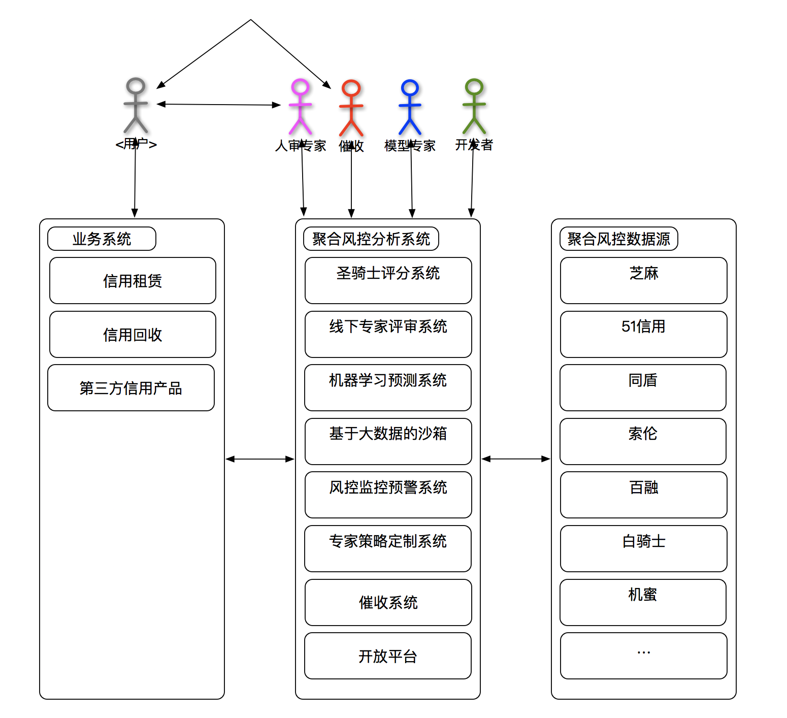
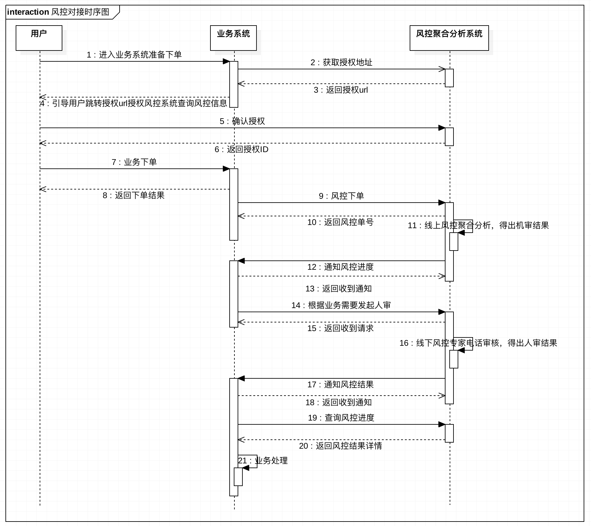

# 机蜜风控开放接口文档

---


## 1.概述
机蜜聚合风控分析系统是集成了芝麻、51信用、同盾、索伦、百融、白骑士等业内知名风控数据结合大数据分析和智能机器学习的手段打造的聚合风控分析系统，对外输出贷前反欺诈和用户画像评分及用户消费形态、贷中用户消费习惯培养和多头借贷预警、贷后催收和资产处置等服务。
### 1.1 总体架构

### 1.2 对接场景

### 1.3 对接准备
 > * step1 向机蜜申请接口调用凭证信息(appid、secret、api_domain)；
 > * step2 向机蜜申请获取调试环境；（注意：测试环境为http协议，而生产环境为https协议）
 > * step3 根据接口文档开发对接接口；
 > * step4 提供服务器IP给机蜜配置白名单；
 > * step5 发布上线。

## 2.调用约定

### 2.1 请求
 > * 接口协议：http
 > * 请求方式：post
 > * 消息格式：application/json
 > * 消息编码：UTF-8
 
请求参数样例：
```
{
    "id":"517080601011",
    "appid":"jimi",
    "name":"xx",
    "sign":""
}
```

### 2.2 响应
 > * 消息格式：application/json
 > * 消息编码：UTF-8

成功响应参数结构：
```
{
    "code":"200",
    "data":{
        "age":"20"
    }
}
```
失败响应参数结构：
```
{
    "code":"501",
    "message":"错误消息详情"
}
```
 
### 2.3 签名算法
为确保接口访问安全，接口的请求和响应应对所有参数使用对称加密算法做签名校验。请求和响应均在header中加入签名参数。
    
Header参数：

| 名称    | 含义   |  类型  | 是否必填 | 备注            |
| :----   | :----  | :----  | :--      | :-------------  |
| appid |    应用唯一标识    |  varchar(15)  | Y | - |
| timestamp |    时间戳    |  varchar(15)  | Y | 时区GMT+8以秒为单位的时间戳 |
| sign    |    签名    |  varchar(15)  | Y | - |

签名算法：
 > * step1：把所有参数（包括appid、secret、timestamp）的key和值拼成字符串放入到数组，得到 array = ['key2=value2','key1=value1']
 > * step2：把数组按照ascii码进行升序排序，得到 array = ['key1=value1','key2=value2']
 > * step3：把数组的元素用&拼成一个字符串，得到 source = 'key1=value1&key2=value2'
 > * step4：根据step3得到的source生成MD5加密值，并转成大写，生成签名。sign=toUpperCase(Md5(source))
 
 
### 2.4 其它
 > * 所有请求和响应参数字段均为字符串格式
 > * 所有请求和响应金额参数的单位均为分

## 3. 接口列表

### 3.1 更新密钥接口
为避免密钥泄露导致安全事故，对接方应定期调用此接口更新密钥。

接口地址：${api_domain}/api/open/secret/update/v1 
请求参数：无
请求示例：
```
{
}
```
响应参数：

| 名称    | 含义   |  类型  | 是否必填 | 备注            |
| :----   | :----  | :----  | :--      | :-------------  |
| secret| 新的密钥 |   varchar(32) | Y | - |

响应示例：
```javascript
{
    "code":"200",
    "data":{
        "secret":""
    }
}
```

###  3.2获取芝麻PASS认证授权地址
接口地址：${api_domain}/api/risk/zmpass/grant/v1 
请求参数：

| 名称    | 含义   |  类型  | 是否必填 | 备注            |
| :----   | :----  | :----  | :--      | :-------------  |
| appType | 支付宝应用标识 |   varchar(10) | Y | migu／jimi |
| soureType | 访问来源 |   varchar(10) | Y | APP／H5 |
| channel | 渠道 |   varchar(20) | Y | alipay |
| callBackUrl | 授权后回调地址 |   varchar(200) | Y | - |

请求示例：
```javascript
{
    "appType": "migu",
    "soureType": "h5",
    "channel": "alipay",
    "callBackUrl": "http://www.jimistore.com/pass/grant.html"
}
```

响应参数：

| 名称    | 含义   |  类型  | 是否必填 | 备注            |
| :----   | :----  | :----  | :--      | :-------------  |
| url | 芝麻PASS认证授权地址 | varchar(200) | Y | - |

响应示例：
```
{
    "code": "200",
    "data": {
        "url": "https://zmhatcher.zmxy.com.cn/creditlife/operatorEntrance.htm?productId=xxxxxx&channel=alipay&callBackUrl=http%3A%2F%2Fwww.jimistore.com%2Fpass%2Fgrant.html"
    }
}
```
获取到“芝麻PASS认证授权地址”之后，需要对接方自行访问打开。


###  3.3获取芝麻PASS认证信息
接口地址：${api_domain}/api/risk/zmpass/confirm/v1 
请求参数：

| 名称    | 含义   |  类型  | 是否必填 | 备注            |
| :----   | :----  | :----  | :--      | :-------------  |
| appType | 支付宝应用标识 |   varchar(10) | Y | migu／jimi |
| channelName | 访问来源 |   varchar(20) | Y | 访问的来源渠道 |
| orderNo |	pass认证订单号 |   varchar(50) | Y | - |


请求示例：
```javascript
{
    "appType": "migu",
    "channelName": "1",
    "orderNo": "1"
}
```

响应参数：

| 名称    | 含义   |  类型  | 是否必填 | 备注            |
| :----   | :----  | :----  | :--      | :-------------  |
| userId | 机蜜用户唯一标识 | varchar(32) | Y | - |
| passId | pass数据唯一标识 | varchar(32) | Y | - |
| zmScore | 芝麻信用分 | varchar(10) | Y | - |

响应示例：
```
{
    "code": "200",
    "data": {
        "userId": "123",
        "passId":"123",
        "zmScore":"777"
    }
}
```

### 3.4 风控聚合模型审核下单
接口地址：${api_domain}/api/risk/auto/create/v1 
请求参数：

| 名称    | 含义   |  类型  | 是否必填 | 备注            |
| :----   | :----  | :----  | :--      | :-------------  |
| callback| 回调地址 |   varchar(200) | Y | - |
| clientId| 调用方下单唯一标识 | varchar(32) | Y | - |
| productId| 风控产品唯一标识 | varchar(32) | Y | 目前只支持pld |
| strategyId| 风控策略唯一标识 | varchar(32) | Y | - |
| authId | 授权ID | varchar(30) | Y | 芝麻的passId 或 京东小白分openId |
| channel | 授权渠道 | varchar(10) | Y | alipay / wechat |
| idcardNum | 用户身份证号码 | varchar(20) | N | 当渠道为非alipay时，该参数不能为空 |
| idcardName | 用户身份证姓名 | varchar(40) | N | 当渠道为非alipay时，该参数不能为空 |
| phone | 用户手机号 | varchar(20) | Y | - |
| provice | 用户收货地址-省 | varchar(20) | Y | - |
| city | 用户收货地址-市 | varchar(20) | Y | - |
| regoin | 用户收货地址-区县 | varchar(40) | Y | - |
| address | 用户收货地址-详细地址 | varchar(100) | Y | - |
| country | 用户收货地址-国家 | varchar(20) | N | 默认“中华人民共和国” |
| qq | 用户QQ号码 | varchar(20) | N | - |
| nickName | 用户常用电商平台昵称 | varchar(20) | N | - |
| sex | 用户性别 | varchar(4) | N | 男/女 |
| age | 用户年龄 | int | N | - |
| ip | 用户设备IP地址 | varchar(30) | N | - |
| email | 用户电子邮箱 | varchar(100) | N | - |
| bankCard | 用户银行卡号 | varchar(30) | N | - |
| mac | 用户设备物理地址 | varchar(30) | N | - |
| wifimac | 用户设备WiFi的物理地址 | varchar(30) | N | - |
| imei | 用户设备标识 | varchar(30) | N | 国际移动设备标识 |
| platform | 应用平台类型 | varchar(10) | N | 应用平台类型，h5；web；ios；android |
| contactsName | 用户联系人姓名 | varchar(40) | N | - |
| contactsMobile | 用户联系人手机号 | varchar(20) | N | - |
| organization | 用户工作单位名称 | varchar(100) | N | - |
| education | 用户学历 | varchar(20) | N | 文盲或半文盲；初中；高中；中专或技校；大专；大学本科；研究生；博士 |
| marriage | 用户婚姻状况 | varchar(10) | N | 未婚；已婚；离异；丧偶 |
| extend | 业务方独有数据源 | varchar(1000) | N | 扩展数据(三方独有数据)；json格式；作用：配合策略规则评分 |

请求示例：
```javascript
{
    "callback":"",
    "clientId":"",
    "name":"",
    "phone":"",
    "extend":{
    	"jm_huabei_disabled":"true",
    	"jm_tongxunlu_uploaded":"true"
    }
}
```

响应参数：

| 名称    | 含义   |  类型  | 是否必填 | 备注            |
| :----   | :----  | :----  | :--      | :-------------  |
| id   | 风控订单号 | varchar(32) | Y | - |
| clientId| 调用方唯一标识 |   varchar(32) | Y | - |

响应示例：
```
{
    "code":"200",
    "data":{
        "id":"000000000000000000001",
        "clientId":"000000000000000000001"
    }
}
```

### 3.5 风控线下专家审核下单
接口地址：${api_domain}/api/risk/offline/create/v1 
请求参数：

| 名称    | 含义   |  类型  | 是否必填 | 备注            |
| :----   | :----  | :----  | :--      | :-------------  |
| callback| 回调地址 |   varchar(200) | Y | - |
| clientId| 调用方唯一标识 |   varchar(32) | Y | - |
| id| 风控订单号 | varchar(32) | Y | - |
| name    |   姓名   |   varchar(20)   | Y | - |
| phone   |    手机    |  varchar(15)  | Y | - |

请求示例：
```javascript
{
    "callback":"",
    "clientId":"",
    "name":"",
    "phone":"",
    "sign":""
}
```
响应参数：

| 名称    | 含义   |  类型  | 是否必填 | 备注            |
| :----   | :----  | :----  | :--      | :-------------  |
| id   | 风控订单号 | varchar(32) | Y | - |
| clientId| 调用方唯一标识 |   varchar(200) | Y | - |

响应示例：
```
{
    "code":"200",
    "data":"success"
}
```
### 3.6 风控结果查询
接口地址：${api_domain}/api/risk/auto/query/v1 

请求参数：

| 名称    | 含义   |  类型  | 是否必填 | 备注            |
| :----   | :----  | :----  | :--      | :-------------  |
| id   | 风控唯一标识 | varchar(32) | N | 两者不能同时为空 |
| clientId| 调用方唯一标识 | varchar(200) | N | 两者不能同时为空 |

请求示例：
```
{
    "id":"0000001"
}
```

响应参数：

| 名称    | 含义   |  类型  | 是否必填 | 备注            |
| :----   | :----  | :----  | :--      | :-------------  |
| pldResult | 风控结果 |   varchar(10) | Y | - |
| pldScore   | 评分 | varchar(32) | Y | - |
| **pldDetail** | 聚合风控命中明细 | [{}] | Y |[{"name":"","value":""}] |
| --name | 命中指标名称 |   varchar(100) | Y | - |
| --value | 命中指标值 |   varchar(100) | Y | - |
| prResult|线下专家审核结果|varchar(10)|N| - |
| **prDetail**|线下专家审核明细| [{}] |N|[{"name":"","value":""}]|
| --name | 命中指标名称 |   varchar(100) | Y | - |
| --value | 命中指标值 |   varchar(100) | Y | - |

响应示例：
```
{
    "code":"200",
    "data":{
        "pldResult":"pass",
        "pldScore":"85",
        "pldDetail":[
        {
            "name":"芝麻分",
            "value":"700"
        }
        ],
        "prResult":"",
        "prDetail":[
        {
            "name":"身份证号和上传的身份证是否一致",
            "value":"否"
        },
        {
            "name":"手机号和上传的手机号是否一致",
            "value":"否"
        }
        ]
    }
}
```

### 3.7 风控进度通知推送
当风控进度有变更时，机蜜风控系统会主动向调用方发起通知推送，推送间隔为（0s/2m/10m/1h/2h/6h/12h/24h），一直间隔推送8次或收到调用方接收成功的响应为止。

接口地址：调用方提供
请求参数：

| 名称    | 含义   |  类型  | 是否必填 | 备注            |
| :----   | :----  | :----  | :--      | :-------------  |
| id | 风控订单号 |   varchar(32) | Y | - |
| clientId | 调用方唯一标识 |   varchar(32) | Y | - |
| pldResult | 风控聚合自动审核结果 |   varchar(10) | Y | - |
| pldScore   | 风控聚合自动审核评分 | varchar(4) | Y | - |
| prResult   | 线下专家审核结果 | varchar(10) | Y | - |

请求示例：
```
{
    "id":"00000000001",
    "clientId":"00000000001",
    "pldResult":"pass",
    "pldScore":"85",
    "prResult":"pass"
}
```
响应参数：字符串
响应示例：
```
SUCCESS
```

### 3.8 催收下单
接口地址：${api_domain}/api/risk/dun/create/v1 
请求参数：

| 名称    | 含义   |  类型  | 是否必填 | 备注            |
| :-----   | :-----  | :----  | :--      | :-------------  |
| clientId| 调用方唯一标识 | varchar(32) | Y | - |
| subject| 账单主体名称 | varchar(200) | Y | - |
| contact| 账单联系人 | varchar(200) | Y | - |
| phone| 账单联系手机 | varchar(200) | Y | - |
| num| 账单期数 | varchar(3) | Y | - |
| amount| 账单总金额 | varchar(12) | Y | 以分为单位 |
| payAmount| 账单已还款总金额 | varchar(12) | Y | 以分为单位 |
| beginTime| 账单产生时间 | varchar(10) | Y | 以秒为单位的时间戳 |
| endTime| 账单到期时间 | varchar(10) | Y | 以秒为单位的时间戳 |
| state| 当前状态 | varchar(2) | Y |0为未到期；1为已逾期；1为逾期后部分还款；2为全部还清； |
| callback | 回调通知地址| varchar(200) | Y |  |
| extend | 预留扩展参数| varchar(200) | N | json格式字符串 |
| **detail** | 账期详情 | {} | Y | 以秒为单位的时间戳 |
| --no | 账期序号 | varchar(3) | Y |  |
| --endTime | 账期应还时间 | varchar(3) | Y | 以秒为单位的时间戳 |
| --amount | 账期金额 | varchar(3) | Y | 以分为单位 |
| --payTime | 账期实际还款时间 | varchar(3) | N | 以秒为单位的时间戳 |
| --payAmount | 账期已还款金额 | varchar(3) | Y | 以分为单位 |

请求示例：
```
{
    "clientId":""
}
```

响应参数：

| 名称    | 含义   |  类型  | 是否必填 | 备注            |
| :----   | :----  | :----  | :--      | :-------------  |
| id   | 催收唯一标识 | varchar(32) | Y | - |
| clientId| 调用方唯一标识 | varchar(200) | Y | - |

响应示例：
```
{
    "code":"200",
    "data":{
        "id":"000000000000000000001",
        "clientId":"000000000000000000001"
    }
}
```


### 3.9 催收还款情况更新
接口地址：${api_domain}/api/risk/dun/update/v1 
请求参数：

| 名称    | 含义   |  类型  | 是否必填 | 备注            |
| :-----   | :-----  | :----  | :--      | :-------------  |
| id| 催收唯一标识 | varchar(32) | Y | - |
| clientId| 调用方唯一标识 | varchar(32) | Y | - |
| payAmount| 账单已还款总金额 | varchar(12) | Y | 以分为单位 |
| state| 当前状态 | varchar(2) | Y |0为未到期；1为已逾期；1为逾期后部分还款；2为全部还清； |
| **detail** | 账期详情 | {} | Y | 以秒为单位的时间戳 |
| --no | 账期序号 | varchar(3) | Y |  |
| --payTime | 账期实际还款时间 | varchar(3) | N | 以秒为单位的时间戳 |
| --payAmount | 账期已还款金额 | varchar(3) | Y | 以分为单位 |

请求示例：
```
{
    "clientId":""
}
```

响应参数：

| 名称    | 含义   |  类型  | 是否必填 | 备注            |
| :----   | :----  | :----  | :--      | :-------------  |
| id   | 催收唯一标识 | varchar(32) | Y | - |
| clientId| 调用方唯一标识 | varchar(200) | Y | - |

响应示例：
```
{
    "code":"200",
    "data":{
        "id":"000000000000000000001",
        "clientId":"000000000000000000001"
    }
}
```

### 3.10 催收结果查询
接口地址：${api_domain}/api/risk/dun/query/v1 

请求参数：

| 名称    | 含义   |  类型  | 是否必填 | 备注            |
| :----   | :----  | :----  | :--      | :-------------  |
| id   | 催收唯一标识 | varchar(32) | Y | - |
| clientId| 调用方唯一标识 | varchar(200) | Y | - |

请求示例：
```
{
    "id":"0000001"
}
```

响应参数：

| 名称    | 含义   |  类型  | 是否必填 | 备注            |
| :----   | :----  | :----  | :--      | :-------------  |
| dunResult | 催收结果 |   varchar(10) | Y | - |
| dunDes | 催收描述 |   varchar(10) | Y | - |

响应示例：
```
{
    "code":"200",
    "data":{
        "dunResult":"0",
        "dunDes":"用户承诺2018-01-06日还款"
    }
}
```

### 3.11 催收进度通知推送
当催收进度有变更时，机蜜催收系统会主动向调用方发起通知推送，推送间隔为（0s/2m/10m/1h/2h/6h/12h/24h），一直间隔推送8次或收到调用方接收成功的响应为止。

接口地址：调用方提供
请求参数：

| 名称    | 含义   |  类型  | 是否必填 | 备注            |
| :----   | :----  | :----  | :--      | :-------------  |
| id | 风控订单号 |   varchar(10) | Y | - |
| clientId | 调用方唯一标识 |   varchar(10) | Y | - |
| dunResult   | 催收结果 | varchar(10) | Y | - |
| dunDes | 催收描述 |   varchar(10) | Y | - |

请求示例：
```
{
    "id":"00000000001",
    "clientId":"00000000001",
    "dunResult":"0",
    "dunDes":"用户承诺2018-01-06日还款"
}
```
响应参数：字符串
响应示例：
```
SUCCESS
```

## 4.错误代码

| 代码编码    | 代码含义   |
| :----  | :-------------  |
| 401    | 访问权限不足或签名异常 |
| 415    | 参数验证异常 |
| 500    | 未知系统异常    |

